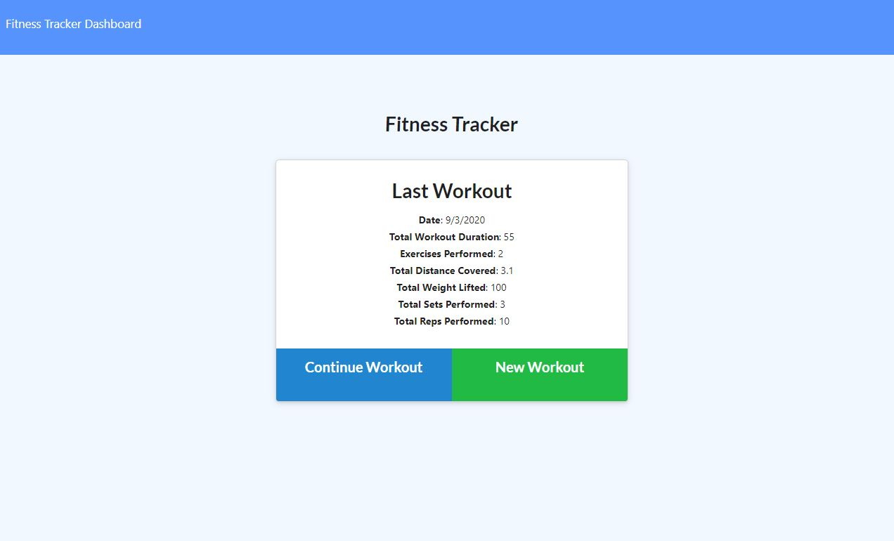
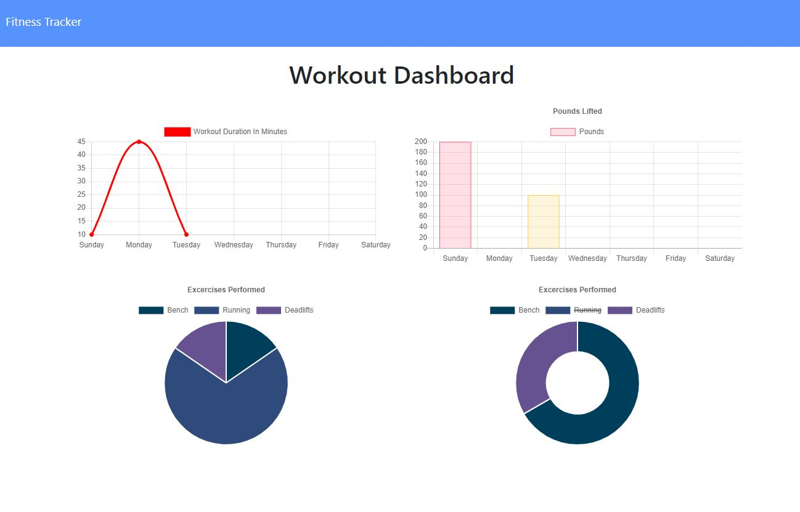

# Workout Tracker

This fitness tracker app allows you to create, view, and track your daily workouts. 

You can log multiple workouts based the exercise type: resistance or cardio. If you are tracking resistance based exercises then the name, type, weight, sets, reps, and duration is logged. If you the excercise type is cardio, the time and distance travelved is logged. 

This workout app uses Mongo database with a Mongoose schema. 

Application deployed by using <a href="https://arcane-beach-46724.herokuapp.com"> Heroku</a>.

---
## Home Page

## Stats

